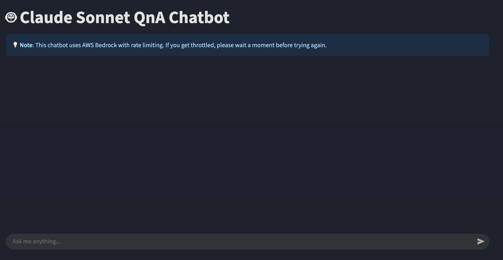
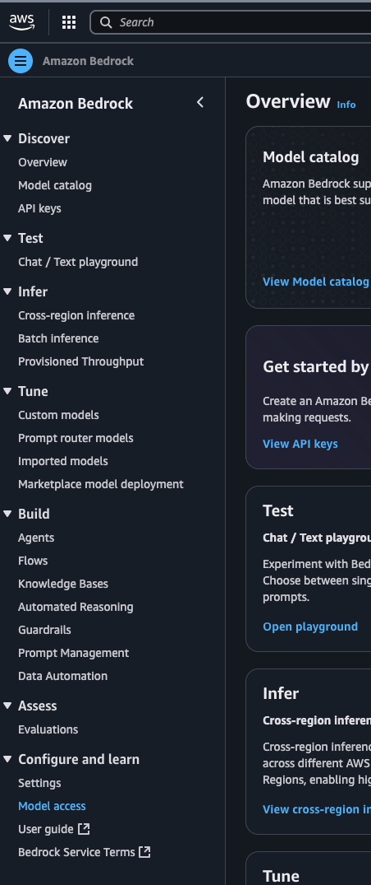
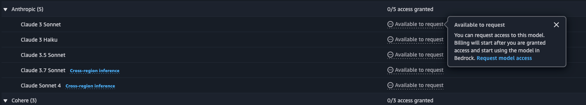
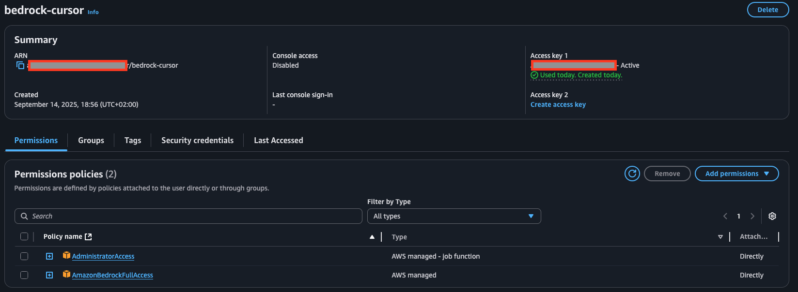
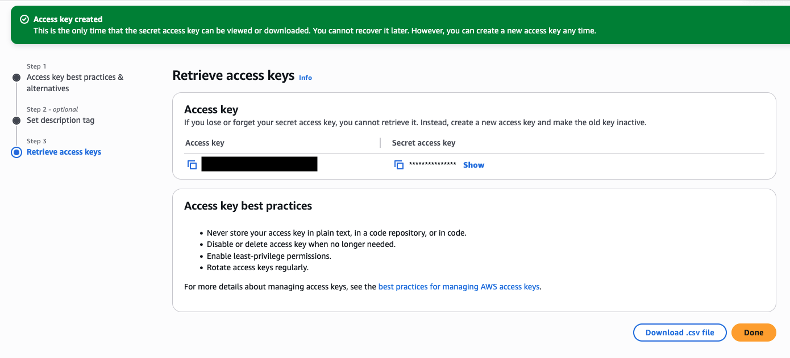
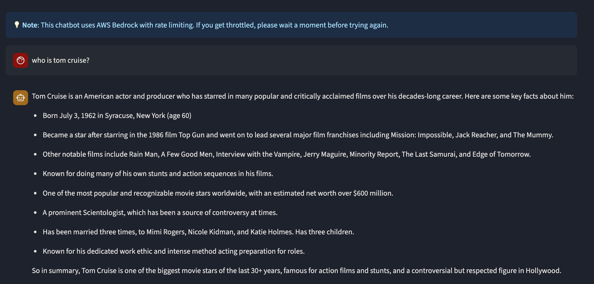

# Sample Cursor Generated Chatbot
The entire code including the README below was generated by Cursor for the demo in this [video](https://youtu.be/m025JCkEwn8).

## Claude Sonnet QnA Chatbot

A Streamlit-based question-answering chatbot powered by Amazon Bedrock's Claude Sonnet model.


*Screenshot of the chatbot running successfully*

## Prerequisites

- Python 3.9 or higher
- AWS account with access to Amazon Bedrock and Claude Sonnet
- AWS credentials with appropriate permissions

## Setup

### 1. Install Dependencies

```bash
pip install -r requirements.txt
```

### 2. Set Up AWS Bedrock Access

#### Step 1: Create AWS Account
If you don't have an AWS account, create one at [aws.amazon.com](https://aws.amazon.com).

#### Step 2: Enable Bedrock Service
1. Log into your AWS Console
2. Navigate to **Amazon Bedrock** service
3. Click **"Get started"** or **"Enable Bedrock"**


*Screenshot of AWS Bedrock console*

#### Step 3: Request Model Access
1. In the Bedrock console, go to **"Model access"** in the left sidebar
2. Find **"Claude 3 Sonnet"** in the list
3. Click **"Request model access"**
4. Wait for approval (usually instant for Claude models)


*Screenshot of requesting Claude model access*

#### Step 4: Create IAM User
1. Go to **IAM** service in AWS Console
2. Click **"Users"** → **"Create user"**
3. Enter username (e.g., `bedrock-chatbot-user`)
4. Select **"Programmatic access"**


*Screenshot of creating IAM user*

#### Step 5: Attach Bedrock Policy
1. In the permissions step, click **"Attach policies directly"**
2. Search for and select **"AmazonBedrockFullAccess"** policy
3. Click **"Next"** → **"Create user"**


*Screenshot of attaching Bedrock policy*

#### Step 6: Get Access Keys
1. Click on your newly created user
2. Go to **"Security credentials"** tab
3. Click **"Create access key"**
4. Select **"Application running outside AWS"**
5. Click **"Create access key"**
6. **IMPORTANT**: Copy and save both Access Key ID and Secret Access Key


*Screenshot of creating access keys*

### 3. Configure Environment Variables

Create a `.env` file in the project root with your AWS credentials:

```bash
# Create .env file
touch .env
```

Add your credentials to the `.env` file:

```bash
AWS_ACCESS_KEY_ID=your_access_key_here
AWS_SECRET_ACCESS_KEY=your_secret_key_here
AWS_REGION=eu-central-1
```

⚠️ **IMPORTANT**: Never commit the `.env` file to version control. It's already included in `.gitignore`.

### 4. Run the Application

```bash
streamlit run app.py
```

The app will be available at http://localhost:8501 in your browser.


*Screenshot of the application running successfully*

## Using the Chatbot

1. **Open the Application**: Navigate to http://localhost:8501 in your browser
2. **Start Chatting**: Type your question in the input box at the bottom
3. **Submit**: Press Enter or click the send button
4. **Wait for Response**: The chatbot will process your question and display Claude Sonnet's response


*Screenshot showing a conversation with the chatbot*

### Features
- **Real-time Chat**: Interactive conversation interface
- **Message History**: View previous messages in the conversation
- **Rate Limiting**: Built-in protection against API rate limits
- **Error Handling**: Graceful error messages for troubleshooting

## Security Considerations

- **Credential Security**: Keep your AWS credentials secure and never share them
- **Environment Variables**: Use `.env` files for local development
- **IAM Roles**: Consider using AWS IAM roles for production deployments
- **Key Rotation**: Regularly rotate your access keys
- **Least Privilege**: Limit permissions to only what's needed for Amazon Bedrock
- **Never Commit**: Never commit `.env` files or credentials to version control

## Troubleshooting

### Common Issues

#### 1. "Access Denied" Error
**Problem**: AWS credentials don't have proper permissions
**Solution**: 
- Verify IAM user has `AmazonBedrockFullAccess` policy
- Check that access keys are correctly set in `.env` file
- Ensure region is set correctly (default: `eu-central-1`)

#### 2. "Model Not Available" Error
**Problem**: Claude model not accessible in your region
**Solution**:
- Check if Claude 3 Sonnet is available in your AWS region
- Request model access in Bedrock console if not already done
- Try switching to a supported region (e.g., `us-east-1`, `us-west-2`)

#### 3. "ThrottlingException" Error
**Problem**: API rate limits exceeded
**Solution**:
- Wait a few minutes before trying again
- The app has built-in retry logic with exponential backoff
- Consider reducing request frequency

#### 4. Application Won't Start
**Problem**: Dependencies or configuration issues
**Solution**:
```bash
# Check Python version (3.9+ required)
python --version

# Reinstall dependencies
pip install -r requirements.txt

# Verify .env file exists and has correct format
cat .env
```

#### 5. "Invalid Credentials" Error
**Problem**: AWS credentials are incorrect or expired
**Solution**:
- Verify credentials in `.env` file
- Check if access keys are still valid in AWS Console
- Create new access keys if needed

### Debug Steps

1. **Check Environment Variables**:
   ```bash
   # Verify .env file exists
   ls -la .env
   
   # Check if variables are loaded
   python -c "import os; from dotenv import load_dotenv; load_dotenv(); print('AWS_ACCESS_KEY_ID:', 'SET' if os.getenv('AWS_ACCESS_KEY_ID') else 'NOT SET')"
   ```

2. **Test AWS Connection**:
   ```bash
   # Test AWS CLI (if installed)
   aws sts get-caller-identity
   ```

3. **Check Application Logs**:
   - Look for error messages in the Streamlit console
   - Check browser developer console for JavaScript errors

### Getting Help

If you're still experiencing issues:
1. Check the [AWS Bedrock documentation](https://docs.aws.amazon.com/bedrock/)
2. Verify your AWS account has Bedrock access in your region
3. Ensure you have the latest version of dependencies
4. Check the [Streamlit documentation](https://docs.streamlit.io/) for UI-related issues
