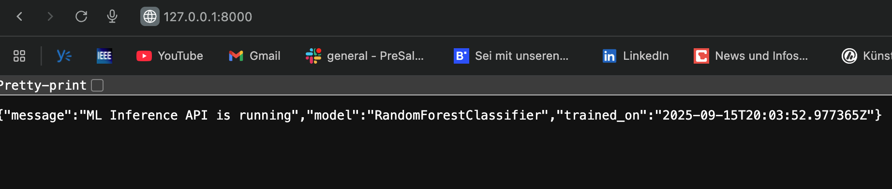

# FastAPI Inference Service
This folder contains the FastAPI application that serves predictions from the latest trained model. We wrap the trained `model.joblib` in a simple FastAPI service (`/predict` endpoint).
and then test it locally (no Docker yet).

## Overview
- Loads the most recent model artifact from `artifacts/model_<timestamp>/`.
- Exposes REST endpoints to check service status and request predictions.
- Built with FastAPI and Uvicorn for lightweight, async serving.

## File Structure
```bash
app/
├─ main.py          # FastAPI app with / and /predict endpoints
└─ model_loader.py  # Helper to load the latest model and metadata
└─ test_request.py  # Helper to test API request
```

## Running Locally
1. Install Dependencies
```bash
pip install -r requirements.txt
```

2. Start the server
```bash
uvicorn app.main:app --reload
```

3. Open -> [http://127.0.0.0:8000](http://127.0.0.0:8000)

You should see this:-


## Testing
With `curl`:-
```curl
curl -X POST http://127.0.0.1:8000/predict \
  -H "Content-Type: application/json" \
  -d '{"features":[5.1, 3.5, 1.4, 0.2]}'
```

**OR** With Python:-
```bash
python -m app.test_request
```

Expected Output
```json
{
  "prediction": 0,
  "class_name": "setosa"
}
```