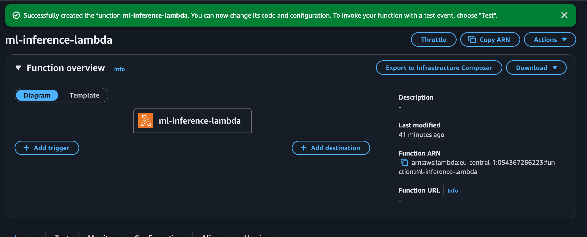
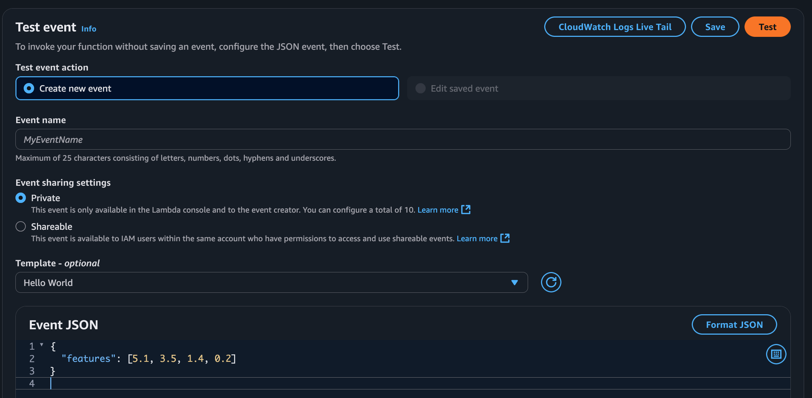
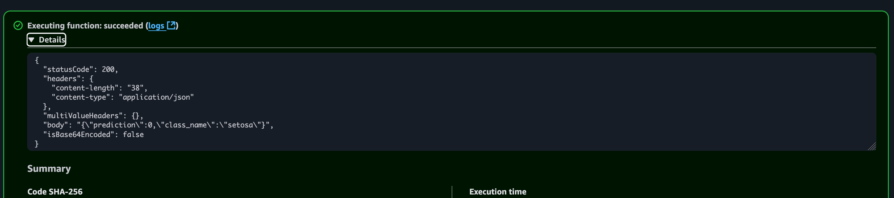

## Testing Results


  ```json
  {
    "statusCode": 200,
    "body": "{\"prediction\":0,\"class_name\":\"setosa\"}"
  }
  ```


## Commands Reference

### AWS Operations
```bash
# Login to ECR
export AWS_ACCOUNT_ID=<your-aws-account-id>
export AWS_REGION=eu-central-1
export IMAGE_TAG=v4
export REPO_NAME=ml-inference
export DOCKER_DIRECTORY=<path-to-directory-containing-Dockerfile>
aws ecr get-login-password --region us-east-1 | docker login --username AWS --password-stdin $AWS_ACCOUNT_ID.dkr.ecr.$AWS_REGION.amazonaws.com

docker build --platform linux/amd64 --provenance=false -t $REPO_NAME:$IMAGE_TAG "$DOCKER_DIRECTORY"

# Tag and push to ECR
docker tag $REPO_NAME:$IMAGE_TAG$ $AWS_ACCOUNT_ID$.dkr.ecr.$AWS_REGION$.amazonaws.com/$REPO_NAME$:$IMAGE_TAG
docker push $AWS_ACCOUNT_ID$.dkr.ecr.$AWS_REGION$.amazonaws.com/$REPO_NAME$:$IMAGE_TAG
```

Now that image is pushed into ECR, 
- Open console at https://console.aws.amazon.com/
- In search, type `lambda`
- Click on `Create Function`
- Choose runtype as `Container Image`
- Name it as `ml-inference-lambda`
- In Browse Images, choose the recent image that you pushed
- Click on Create function



## Testing the function

- Mangum expects an API Gateway/ALB event, not a raw JSON dict.
- In the Lambda console Test tab, choose the template “API Gateway AWS Proxy” and use something like:
```json
{
  "resource": "/predict",
  "path": "/predict",
  "httpMethod": "POST",
  "headers": {
    "content-type": "application/json"
  },
  "queryStringParameters": null,
  "pathParameters": null,
  "stageVariables": null,
  "requestContext": {
    "resourcePath": "/predict",
    "httpMethod": "POST",
    "path": "/predict"
  },
  "body": "{\"features\": [5.1, 3.5, 1.4, 0.2]}",
  "isBase64Encoded": false
}
```
- Click on `Test`



## Key Learnings & Troubleshooting

### Docker Build Issues
- **Problem**: C++ compiler missing for matplotlib dependencies
- **Solution**: Added build dependencies (`gcc`, `gcc-c++`, `make`) to Dockerfile
- **Lesson**: AWS Lambda base images are minimal and need build tools

### Cannot create Lambda function
- **Problem**: Image manifest or mdeida type isn't supported
- **Solution**: add `--provenance=false` and `--platform linux/amd64` flags because Apple Silicon doesn't natively support AWS Lambda compatible docker images
- **Lesson**: Check your infrastrucure

### Lambda Handler Configuration
- **Problem**: Incorrect handler format (`app.main:handler`)
- **Solution**: Use dot notation (`app.main.handler`) for Lambda
- **Lesson**: Lambda expects module.function format, not module:function

### Performance Optimization
- **Problem**: MLflow causing slow initialization (10+ seconds)
- **Solution**: Removed MLflow from inference requirements
- **Lesson**: Keep inference containers minimal - only include runtime dependencies

### Testing in Lambda Console
- **Problem**: Direct JSON input doesn't work with Mangum
- **Solution**: Use API Gateway proxy event format for testing
- **Lesson**: Mangum expects HTTP event structure, not raw JSON

### Timeouts when running lambda function
- **Problem**: The timeout is happening because your Lambda function is taking too long to initialize. The problem is likely that MLflow is being imported (from your requirements.txt) and it's heavy.
- **Solution**: In AWS Lambda console, click on `Configuration` and change the following settings:-
Timeout: Increase to 30 seconds (or more)
Memory: Increase to 512 MB or 1024 MB