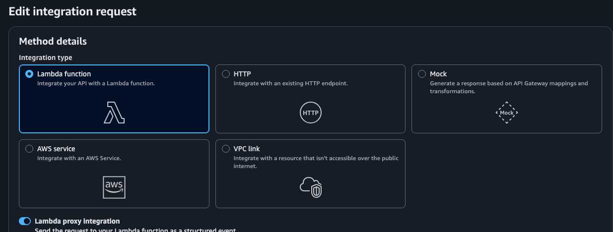
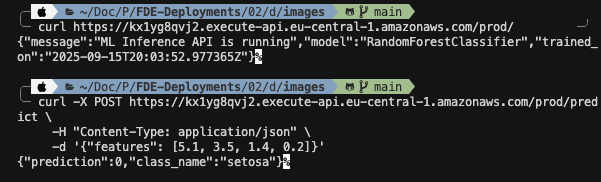

# API Gateway Integration

## Why API Gateway Integration?

After successfully deploying our ML model to AWS Lambda, we needed to make it accessible via HTTP requests. While Lambda functions can be invoked directly, they're not designed to handle HTTP traffic natively. API Gateway serves as the bridge between HTTP clients and Lambda functions, providing:

- **Public HTTPS endpoints** for external access
- **Request/response transformation** between HTTP and Lambda event format
- **Authentication and authorization** capabilities
- **Rate limiting and throttling** for production use
- **Monitoring and logging** integration with CloudWatch
- **Custom domains and SSL certificates** for professional APIs

## Architecture Overview

```
┌─────────────────┐    ┌─────────────────┐    ┌─────────────────┐
│   HTTP Client   │───▶│   API Gateway   │───▶│   Lambda        │
│   (curl, etc.)  │    │                 │    │   Function      │
│                 │    │ • HTTPS/SSL     │    │                 │
│ • Web Apps      │    │ • Rate Limiting │    │ • FastAPI       │
│ • Mobile Apps   │    │ • Auth          │    │ • Mangum        │
│ • Other APIs    │    │ • Monitoring    │    │ • Model Logic   │
└─────────────────┘    └─────────────────┘    └─────────────────┘
```

## Step-by-Step Implementation

### Step 1: Create REST API

1. **Navigate to API Gateway Console**
   - Go to AWS Console → API Gateway
   - Click "Create API"

2. **Choose API Type**
   - Select "REST API" (not HTTP API)
   - Click "Build"

3. **Configure API Settings**
   - **API Name**: `ml-inference-api`
   - **Description**: `ML Model Inference API`
   - **Endpoint Type**: Regional (default)
   - Click "Create API"

### Step 2: Create API Resources

#### 2.1 Root Resource (`/`)
- The root resource `/` is created automatically
- This will serve our health check endpoint

#### 2.2 Predict Resource (`/predict`)
1. **Create Resource**:
   - Click "Actions" → "Create Resource"
   - **Resource Name**: `predict`
   - **Resource Path**: `/predict`
   - **Enable CORS**: ✅ Check this box
   - Click "Create Resource"

### Step 3: Configure HTTP Methods

#### 3.1 GET Method for Root (`/`)
1. **Select the root `/` resource**
2. **Create Method**:
   - Click "Actions" → "Create Method"
   - Choose "GET" from dropdown
   - Click the checkmark
3. **Configure Integration**:
   - **Integration type**: Lambda Function
   - **Lambda Region**: Select your region (e.g., `eu-central-1`)
   - **Lambda Function**: Select your Lambda function name
   - **Use Lambda Proxy integration**: ✅ **Must be checked**
   - Click "Save"
4. **Grant Permission**: Click "OK" when prompted to grant API Gateway permission



#### 3.2 POST Method for Predict (`/predict`)
1. **Select the `/predict` resource**
2. **Create Method**:
   - Click "Actions" → "Create Method"
   - Choose "POST" from dropdown
   - Click the checkmark
3. **Configure Integration**:
   - **Integration type**: Lambda Function
   - **Lambda Region**: Select your region
   - **Lambda Function**: Select your Lambda function name
   - **Use Lambda Proxy integration**: ✅ **Must be checked**
   - Click "Save"
4. **Grant Permission**: Click "OK" when prompted

### Step 4: Enable CORS (Cross-Origin Resource Sharing)

1. **Select the `/predict` resource**
2. **Enable CORS**:
   - Click "Actions" → "Enable CORS"
   - **Access-Control-Allow-Origin**: `*` (or your specific domain)
   - **Access-Control-Allow-Headers**: `Content-Type,X-Amz-Date,Authorization,X-Api-Key,X-Amz-Security-Token`
   - **Access-Control-Allow-Methods**: `POST,OPTIONS`
   - Click "Enable CORS and replace existing CORS headers"

### Step 5: Deploy the API

1. **Deploy API**:
   - Click "Actions" → "Deploy API"
   - **Deployment stage**: `[New Stage]`
   - **Stage name**: `prod`
   - **Stage description**: `Production stage`
   - Click "Deploy"

2. **Get Invoke URL**:
   - After deployment, note the **Invoke URL**
   - Format: `https://abc123def4.execute-api.eu-central-1.amazonaws.com/prod`

## Testing the API

### Test Commands

```bash
# Test root endpoint (health check)
curl https://kx1yg8qvj2.execute-api.eu-central-1.amazonaws.com/prod/

# Test predict endpoint
curl -X POST https://kx1yg8qvj2.execute-api.eu-central-1.amazonaws.com/prod/predict \
     -H "Content-Type: application/json" \
     -d '{"features": [5.1, 3.5, 1.4, 0.2]}'
```

### Expected Responses

#### Root Endpoint (`GET /`)
```json
{
  "message": "ML Inference API is running",
  "model": "RandomForestClassifier",
  "trained_on": "2025-09-15T20:03:52Z"
}
```

#### Predict Endpoint (`POST /predict`)
```json
{
  "prediction": 0,
  "class_name": "setosa"
}
```



## Common Issues and Solutions

### Issue 1: "Missing Authentication Token" Error

**Problem**: API Gateway returns "Missing Authentication Token" when accessing endpoints.

**Root Causes**:
- Wrong URL format (missing trailing slash)
- Resource not created properly
- Method not configured
- API not deployed after changes

**Solutions**:
1. **Check URL Format**:
   - ✅ Correct: `https://api-id.execute-api.region.amazonaws.com/prod/`
   - ❌ Wrong: `https://api-id.execute-api.region.amazonaws.com/prod`

2. **Verify Resource Structure**:
   ```
   API Gateway Resources:
   /
   └── predict
   ```
   Both resources should exist with proper methods.

3. **Ensure Methods Are Created**:
   - `/` should have GET method
   - `/predict` should have POST method

4. **Redeploy After Changes**:
   - Always click "Actions" → "Deploy API" after making changes

### Issue 2: Mangum Handler Inference Error

**Problem**: Lambda returns error: "The adapter was unable to infer a handler to use for the event"

**Root Cause**: API Gateway is not sending properly formatted events to Lambda.

**Solutions**:
1. **Verify Lambda Proxy Integration**:
   - In API Gateway → Integration Request
   - ✅ Check "Use Lambda Proxy integration"
   - This ensures proper event format

2. **Test Lambda Directly**:
   ```json
   {
     "resource": "/",
     "path": "/",
     "httpMethod": "GET",
     "headers": {
       "Accept": "application/json",
       "Content-Type": "application/json"
     },
     "queryStringParameters": null,
     "pathParameters": null,
     "body": null,
     "isBase64Encoded": false
   }
   ```

3. **Alternative: Use HTTP API**:
   - HTTP API is simpler and more reliable for Lambda proxy integrations
   - Better performance and lower cost
   - Automatic request/response transformation

### Issue 3: CORS Errors

**Problem**: Browser-based requests fail with CORS errors.

**Solution**:
1. **Enable CORS** on resources that need it
2. **Configure CORS Headers**:
   - Access-Control-Allow-Origin: `*` (or specific domain)
   - Access-Control-Allow-Methods: `POST,OPTIONS`
   - Access-Control-Allow-Headers: `Content-Type,X-Amz-Date,Authorization,X-Api-Key,X-Amz-Security-Token`

### Issue 4: Lambda Timeout

**Problem**: API Gateway requests timeout.

**Solutions**:
1. **Increase Lambda Timeout**: 30 seconds (max for API Gateway)
2. **Optimize Model Loading**: Remove unnecessary dependencies
3. **Use Provisioned Concurrency**: For consistent performance

## Key Learnings

### 1. Lambda Proxy Integration is Critical
- ✅ Always check "Use Lambda Proxy integration"
- This ensures API Gateway sends properly formatted events
- Mangum adapter can correctly parse the events

### 2. Resource Structure Matters
- Create resources in logical hierarchy
- Each resource needs explicit method configuration
- Deploy after every change

### 3. Testing Strategy
- Test Lambda function directly first
- Use proper API Gateway event format
- Test both endpoints independently

### 4. CORS Configuration
- Enable CORS for browser-based clients
- Configure appropriate headers
- Test from different origins

## Performance Considerations

### Response Times
- **Cold Start**: 3-5 seconds (first request)
- **Warm Requests**: <100ms
- **API Gateway Overhead**: ~50ms

### Optimization Tips
1. **Use HTTP API** instead of REST API for better performance
2. **Enable Lambda Provisioned Concurrency** for consistent performance
3. **Optimize Lambda package size** by removing unused dependencies
4. **Use API Gateway caching** for frequently accessed data

## Security Considerations

### Current Setup
- ✅ HTTPS encryption (automatic with API Gateway)
- ✅ Regional endpoint (data stays in region)
- ❌ No authentication (public access)

### Future Enhancements
- **API Keys**: For basic authentication
- **IAM Roles**: For AWS service access
- **Cognito**: For user authentication
- **WAF**: For DDoS protection

## Monitoring and Logging

### CloudWatch Integration
- **API Gateway Logs**: Request/response logging
- **Lambda Logs**: Function execution logs
- **Metrics**: Request count, latency, error rates
- **Alarms**: Set up alerts for errors and high latency

### Key Metrics to Monitor
- **4XX Errors**: Client errors (bad requests)
- **5XX Errors**: Server errors (Lambda failures)
- **Latency**: Response time percentiles
- **Throttling**: Rate limit violations

## Next Steps

### Immediate Improvements
1. **Add API Keys** for basic authentication
2. **Set up monitoring** with CloudWatch alarms
3. **Configure rate limiting** to prevent abuse
4. **Add request validation** in API Gateway

### Future Enhancements
1. **Custom Domain**: Use your own domain name
2. **SSL Certificate**: Custom SSL certificate
3. **API Versioning**: Support multiple API versions
4. **Documentation**: Auto-generated API docs with Swagger

## Cost Considerations

### API Gateway Pricing (REST API)
- **Requests**: $3.50 per million requests
- **Data Transfer**: $0.09 per GB
- **Cache**: $0.025 per GB-hour

### Lambda Pricing
- **Requests**: $0.20 per million requests
- **Duration**: $0.0000166667 per GB-second

### Estimated Monthly Cost (1000 requests/day)
- **API Gateway**: ~$0.11
- **Lambda**: ~$0.01
- **Total**: ~$0.12/month

---

*Last Updated: September 17, 2025*
*Status: API Gateway integration successful, public HTTPS endpoint operational*
