# Monitoring & Observability

## Overview

This document describes the comprehensive monitoring and observability setup for the ML deployment pipeline, covering both infrastructure monitoring (CloudWatch) and ML-specific monitoring (MLflow).

## Monitoring Strategy

### **Two-Tier Monitoring Approach**

```
┌─────────────────┐    ┌─────────────────┐    ┌─────────────────┐
│   CloudWatch    │    │   MLflow        │    │   Custom        │
│   (Infrastructure)│   │   (ML-Specific) │    │   Dashboards    │
│                 │    │                 │    │                 │
│ • System Health │    │ • Model Metrics │    │ • Business KPIs │
│ • Performance   │    │ • Data Drift    │    │ • User Behavior │
│ • Errors        │    │ • Model Version │    │ • Cost Tracking │
│ • Alerts        │    │ • Experiments   │    │ • ROI Analysis  │
└─────────────────┘    └─────────────────┘    └─────────────────┘
```

## AWS CloudWatch Monitoring (Infrastructure)

### **What We Monitor**

#### 1. **System Health Metrics**
- **Lambda Performance**: Duration, memory usage, cold starts
- **API Gateway**: Request count, latency, error rates
- **ECR**: Image push/pull events
- **CloudWatch Logs**: Application logs and errors

#### 2. **ML-Specific Metrics**
- **Inference Latency**: Time taken for predictions
- **Inference Count**: Number of predictions made
- **Error Count**: Failed predictions
- **Prediction Distribution**: Class distribution of predictions
- **Input Feature Statistics**: Mean, sum of input features

#### 3. **Business Metrics**
- **Request Volume**: Total API calls
- **Success Rate**: Percentage of successful predictions
- **Cost per Prediction**: AWS costs divided by prediction count
- **User Behavior**: Peak usage times, geographic distribution

## AWS Console Setup Guide

### **Step 1: Create CloudWatch Dashboard**

1. **Go to CloudWatch Console**
   - Navigate to AWS Console → CloudWatch
   - Click "Dashboards" in the left sidebar
   - Click "Create dashboard"


2. **Configure Dashboard**
   - **Dashboard name**: `ML-Inference-Dashboard`
   - **Description**: `Monitoring dashboard for ML inference pipeline`
   - Click "Create dashboard"
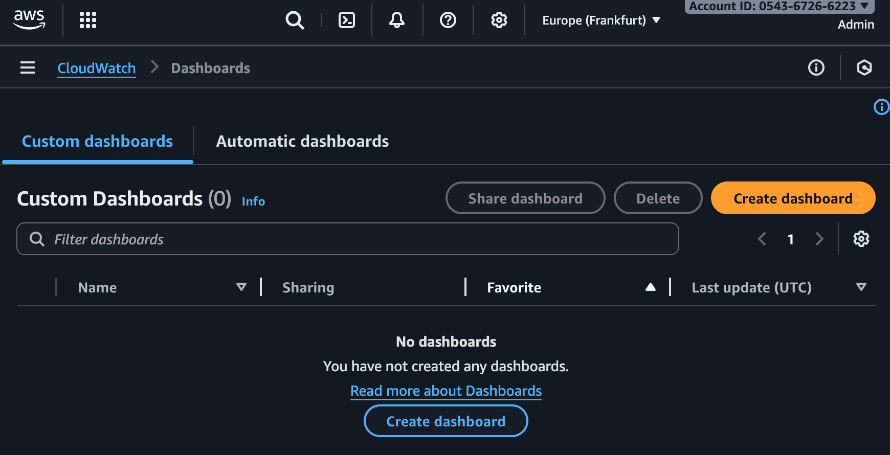


3. **Add Widget 1: Request Volume**
   - Click "Add widget"
   - Choose "Line" widget
   - **Metrics**: 
     - Namespace: `AWS/Lambda`
     - Metric: `Invocations`
     - Dimension: `FunctionName` = `ml-inference-lamdba-function`
   - **Period**: 5 minutes
   - **Statistic**: Sum
   - **Title**: `Request Volume`
   - Click "Create widget"
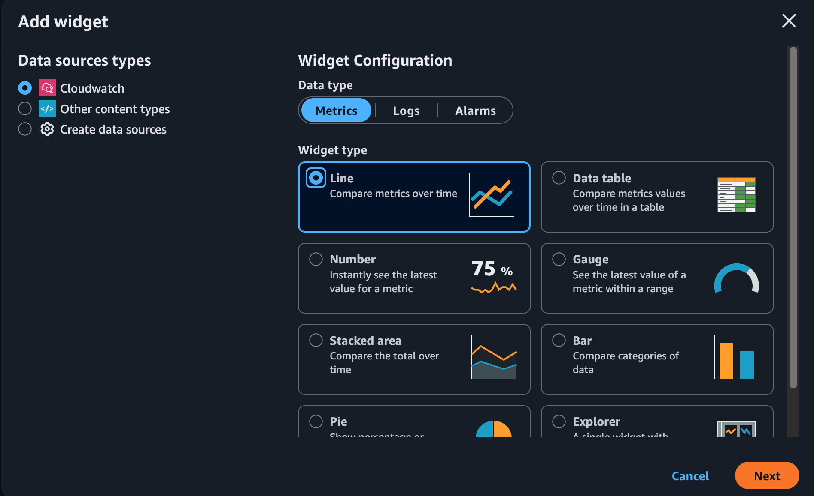

4. **Add Widget 2: Lambda Duration**
   - Click "Add widget"
   - Choose "Line" widget
   - **Metrics**:
     - Namespace: `AWS/Lambda`
     - Metric: `Duration`
     - Dimension: `FunctionName` = `ml-inference-lamdba-function`
   - **Period**: 5 minutes
   - **Statistic**: Average
   - **Title**: `Lambda Duration (ms)`
   - Click "Create widget"

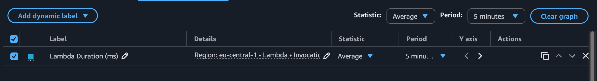

5. **Add Widget 3: Error Rate**
   - Click "Add widget"
   - Choose "Line" widget
   - **Metrics**:
     - Namespace: `AWS/Lambda`
     - Metric: `Errors`
     - Dimension: `FunctionName` = `ml-inference-lamdba-function`
   - **Period**: 5 minutes
   - **Statistic**: Sum
   - **Title**: `Error Count`
   - Click "Create widget"


6. **Add Widget 4: API Gateway Metrics**
   - Click "Add widget"
   - Choose "Line" widget
   - **Metrics**:
     - Namespace: `AWS/ApiGateway`
     - Metric: `Count`
     - Dimension: `ApiName` = `ml-inference-api` (or your API name)
   - **Period**: 5 minutes
   - **Statistic**: Sum
   - **Title**: `API Gateway Requests`
   - Click "Create widget"


7. **Final Dashboard Layout**
   - Arrange widgets in a 2x2 grid
   - Save the dashboard
   - Note the dashboard URL for future reference

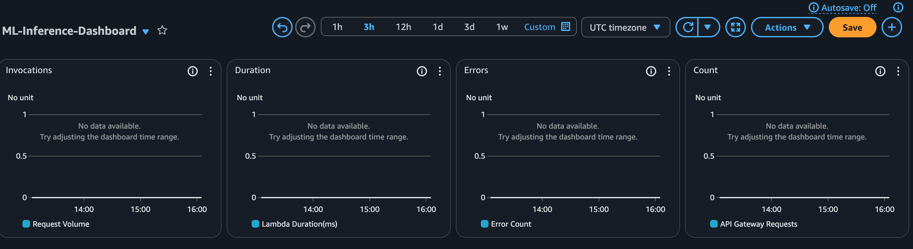

### **Step 2: Create CloudWatch Alarms**

1. **Go to Alarms**
   - In CloudWatch Console, click "Alarms" in the left sidebar
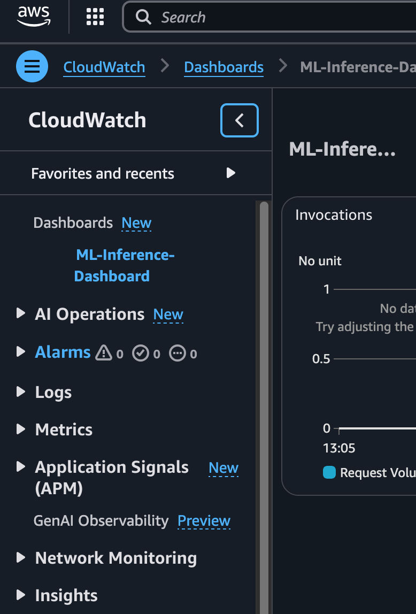
   - Click "Create alarm"
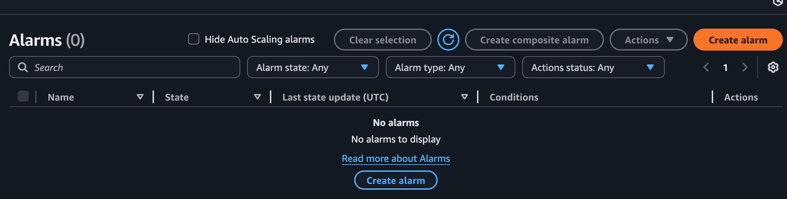


1. **Create High Latency Alarm**
   - Click "Create alarm" again
   - **Metric**:
     - Namespace: `AWS/Lambda`
     - Metric: `Duration`
     - Dimension: `FunctionName` = `ml-inference-lamdba-function`
   - **Conditions**:
     - **Threshold type**: Static
     - **Alarm condition**: Greater than 1000 (milliseconds)
     - **Period**: 5 minutes
     - **Evaluation periods**: 2
   - **Alarm name**: `ML-Inference-High-Latency`
   - **Description**: `High latency in ML inference (>1000ms average)`
   - Click "Next" → "Next" → "Create alarm"
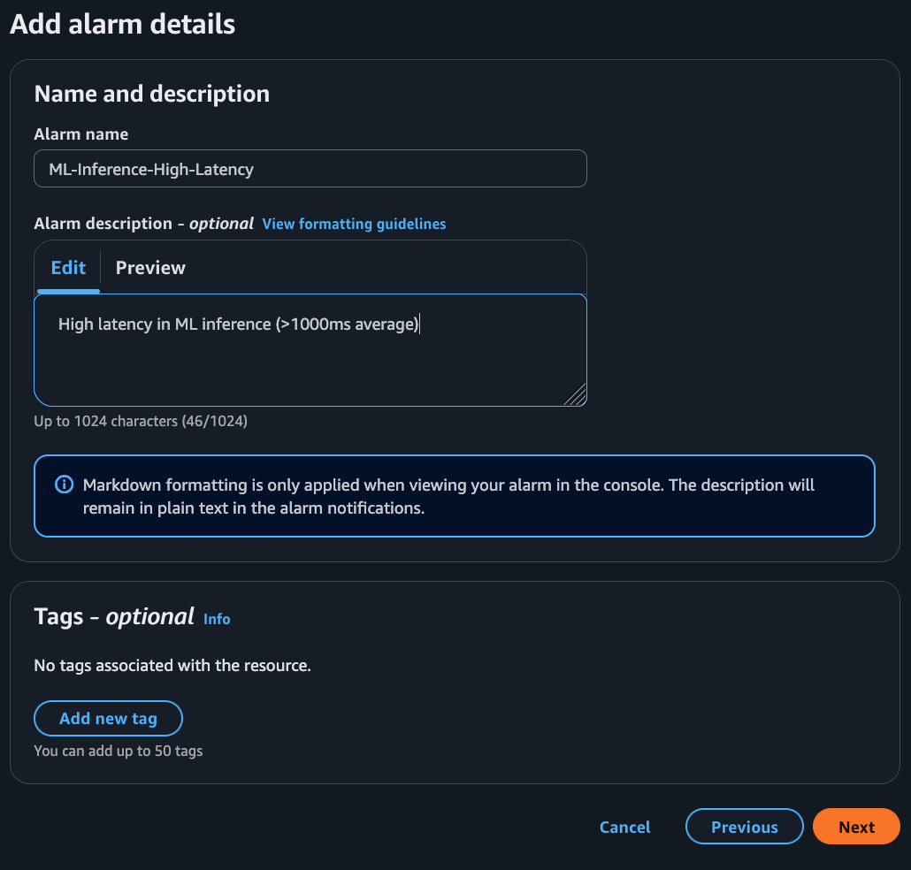

2. **Configure Actions**
   - **Notification**: Choose "Create new SNS topic" (optional)
   - **Topic name**: `ML-Inference-Alerts`
   - **Email**: Your email address
   - Click "Create topic"
   - Click "Next"

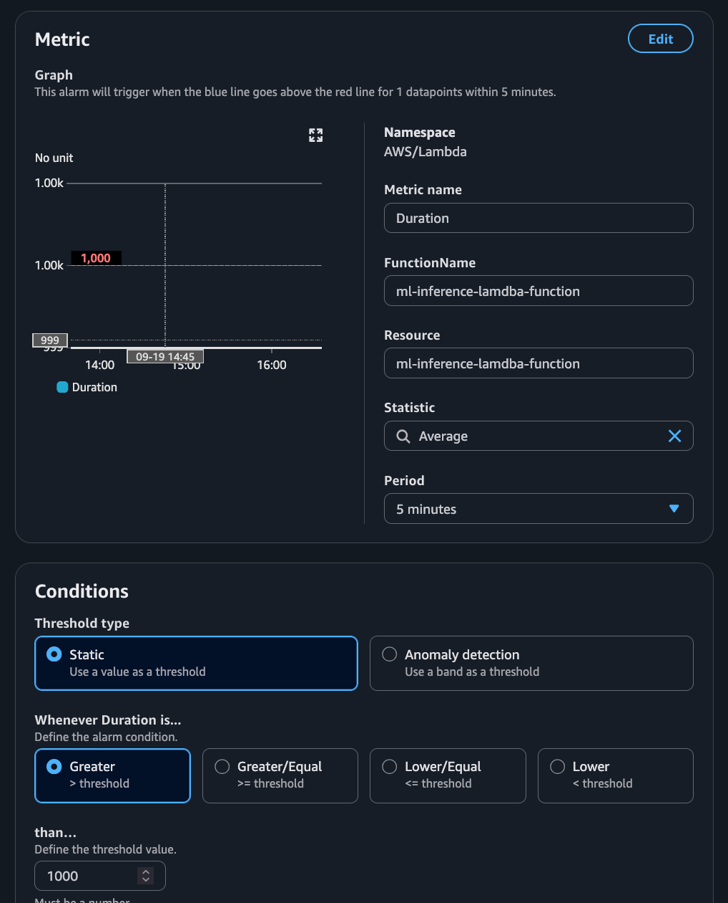
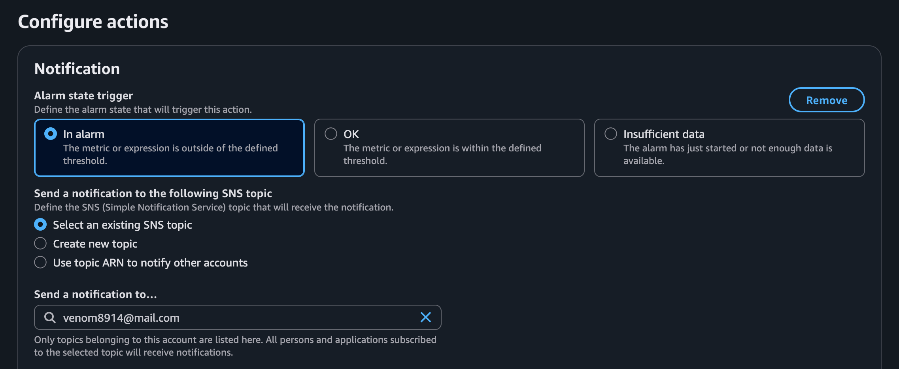
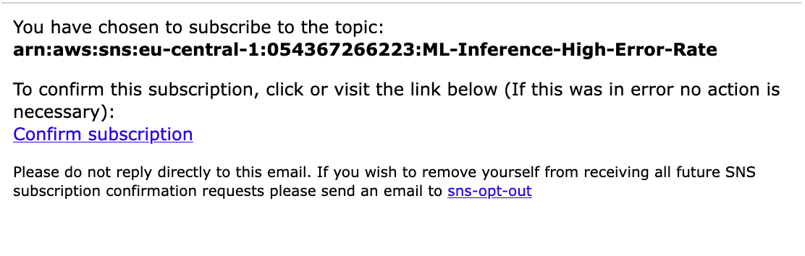

1. **Create High Error Rate Alarm**
   - **Metric**: 
     - Namespace: `AWS/Lambda`
     - Metric: `Errors`
     - Dimension: `FunctionName` = `ml-inference-lamdba-function`
   - **Conditions**:
     - **Threshold type**: Static
     - **Alarm condition**: Greater than 5
     - **Period**: 5 minutes
     - **Evaluation periods**: 2
   - **Alarm name**: `ML-Inference-High-Error-Rate`
   - **Description**: `High error rate in ML inference (>5 errors in 5 minutes)`
   - Click "Next"


4. **Review and Create**
   - Review the alarm configuration
   - Click "Create alarm"

   *[Screenshot: Alarm review page]*

5. **Verify Alarms**
   - Go back to the Alarms page
   - You should see both alarms in "OK" state
   - Note the alarm names and their current status

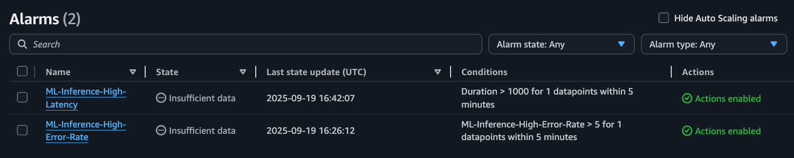

### **Step 4: View Logs**

1. **Go to Log Groups**
   - In CloudWatch Console, click "Logs" → "Log groups"
   - Find `/aws/lambda/ml-inference-lamdba-function`


2. **View Recent Logs**
   - Click on the log group
   - Click on the most recent log stream
   - You'll see your application logs and any monitoring output

   *[Screenshot: Log stream contents]*

### **Step 5: Test the Monitoring**

1. **Make API Calls**
   ```bash
   # Test your API endpoint
   curl -X POST https://your-api-gateway-url/predict \
        -H "Content-Type: application/json" \
        -d '{"features": [5.1, 3.5, 1.4, 0.2]}'
   ```

2. **Check Dashboard**
   - Go back to your dashboard
   - Wait 5-10 minutes for metrics to appear
   - You should see:
     - Request volume increasing
     - Duration metrics
     - Error counts (hopefully 0!)


3. **Check Alarms**
   - Go to "Alarms" section
   - Your alarms should be in "OK" state
   - If they trigger, you'll get email notifications


### **Step 7: Verify Custom Metrics**

1. **Wait for Deployment**
   - Wait for the CI/CD pipeline to complete
   - This usually takes 5-10 minutes

2. **Make Test API Calls**
   ```bash
   # Make several API calls to generate metrics
   for i in {1..10}; do
     curl -X POST https://your-api-gateway-url/predict \
          -H "Content-Type: application/json" \
          -d '{"features": [5.1, 3.5, 1.4, 0.2]}'
     sleep 1
   done
   ```


## What You'll See

### **Dashboard Metrics**

- **Request Volume**: Number of API calls over time
- **Lambda Duration**: How long each prediction takes
- **Error Count**: Number of failed requests
- **API Gateway Requests**: Total API calls
- **Prediction Distribution**: Which classes are being predicted

### **Alarms**
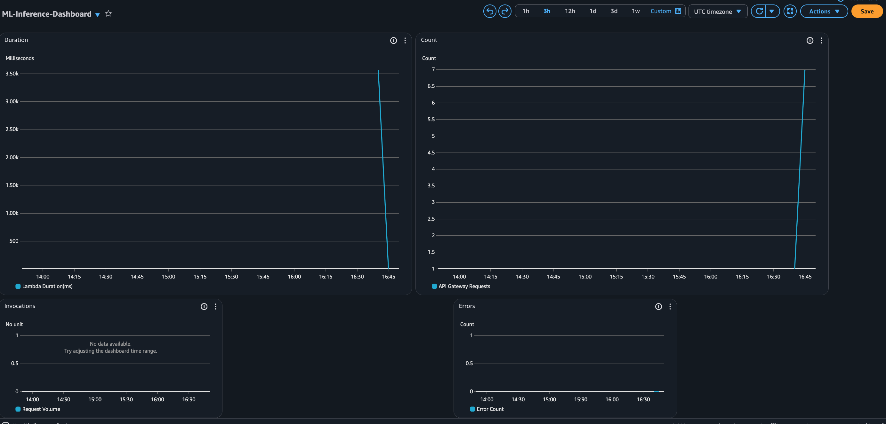
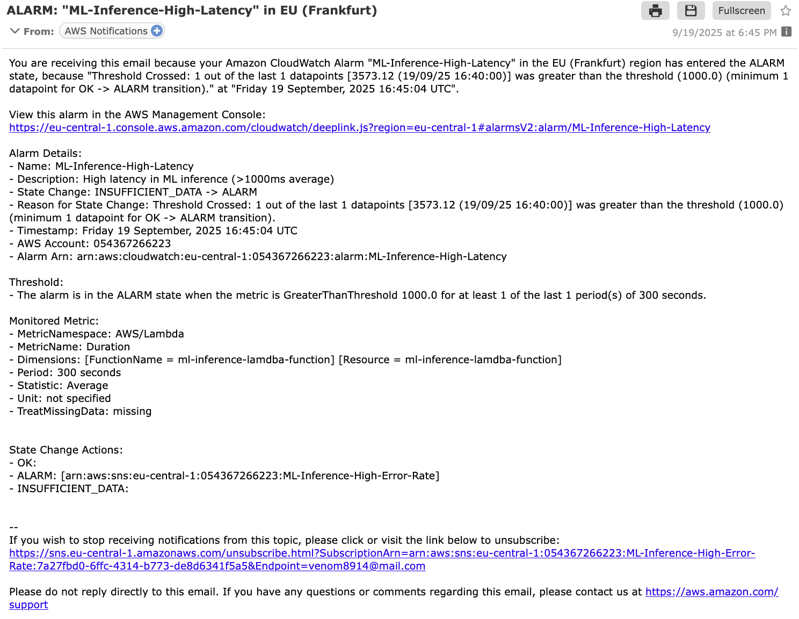
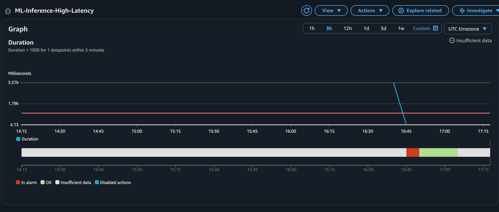
- **High Error Rate**: Triggers if >5 errors in 5 minutes
- **High Latency**: Triggers if average response time >1000ms

### **Logs**
- Application logs from your Lambda function
- Monitoring output and any errors

## Benefits of This Setup

✅ **Real-time Monitoring**: See metrics as they happen
✅ **Visual Dashboards**: Easy to understand charts and graphs
✅ **Automatic Alerts**: Get notified when things go wrong
✅ **Historical Data**: Track trends over time
✅ **Cost Tracking**: Monitor AWS costs
✅ **Performance Optimization**: Identify bottlenecks

## Key Metrics to Monitor

### **Infrastructure Metrics**
- **Lambda Duration**: Should be <500ms for good performance
- **Lambda Errors**: Should be <1% error rate
- **API Gateway Latency**: Should be <100ms
- **Memory Usage**: Should be <80% of allocated memory

### **ML Metrics**
- **Inference Latency**: Should be <200ms
- **Prediction Accuracy**: Should match training accuracy
- **Data Drift**: Input features should remain stable
- **Model Performance**: Should not degrade over time

### **Business Metrics**
- **Request Volume**: Track usage patterns
- **Success Rate**: Should be >99%
- **Cost per Prediction**: Track operational costs
- **User Satisfaction**: Response time and accuracy

## Troubleshooting Guide

### **Common Issues**

#### 1. **Metrics Not Appearing**
**Problem**: CloudWatch metrics not showing up
**Solutions**:
- Wait 5-10 minutes for metrics to appear
- Check Lambda function logs for errors
- Verify IAM permissions for CloudWatch
- Check if metrics are being sent (look for "Failed to send metrics" in logs)

#### 2. **High Latency**
**Problem**: Inference taking too long
**Solutions**:
- Check Lambda memory allocation
- Look for cold starts in CloudWatch
- Verify model size and complexity
- Check for network issues

#### 3. **High Error Rate**
**Problem**: Many failed predictions
**Solutions**:
- Check input data validation
- Verify model compatibility
- Look for memory issues
- Check for data format problems

### **Debugging Steps**

1. **Check CloudWatch Logs**:
   ```bash
   aws logs describe-log-groups --log-group-name-prefix "/aws/lambda/ml-inference"
   ```

2. **View Recent Metrics**:
   ```bash
   aws cloudwatch get-metric-statistics \
     --namespace "ML/Inference" \
     --metric-name "InferenceLatency" \
     --start-time 2025-09-18T00:00:00Z \
     --end-time 2025-09-18T23:59:59Z \
     --period 300 \
     --statistics Average
   ```

3. **Test API Endpoints**:
   ```bash
   curl -v https://your-api-gateway-url/predict \
        -H "Content-Type: application/json" \
        -d '{"features": [5.1, 3.5, 1.4, 0.2]}'
   ```

## Future Enhancements

### **Advanced Monitoring**
- [ ] **Distributed Tracing**: End-to-end request tracing
- [ ] **Custom Dashboards**: Business-specific metrics
- [ ] **MLflow Integration**: Model performance tracking
- [ ] **Anomaly Detection**: Automatic anomaly detection

### **ML-Specific Features**
- [ ] **Data Drift Detection**: Automatic drift detection
- [ ] **Model Performance Tracking**: Continuous performance monitoring
- [ ] **A/B Testing**: Model comparison and testing
- [ ] **Automated Retraining**: Trigger retraining based on performance

### **Operational Excellence**
- [ ] **SLA Monitoring**: Service level agreement tracking
- [ ] **Capacity Planning**: Predictive scaling
- [ ] **Cost Optimization**: Automated cost optimization
- [ ] **Security Monitoring**: Security event detection

---

*Last Updated: September 18, 2025*
*Status: CloudWatch monitoring setup guide completed*
